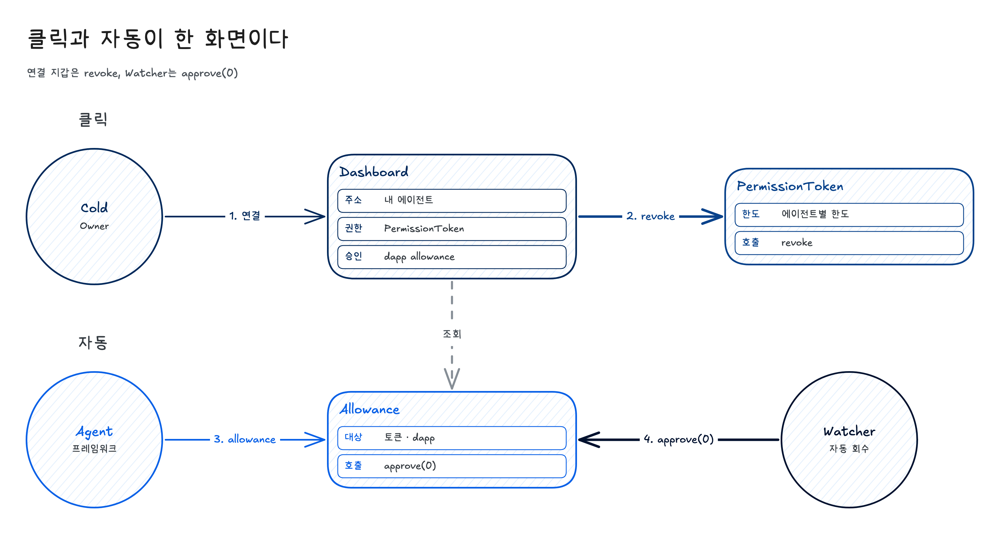

# BAY 18th — Agent AI Kill Switch

BAY 리서치 아티클 「AI Agent Wallet과 권한 위임 구조」 5장(구현: "Revoke Cash — AI agentic ver.")의 코드 저장소입니다.
Revoke.cash가 **지갑**의 approval을 점검·회수한다면, 이 프로젝트는 **지갑이 위임한 AI 에이전트**의 권한을 관리합니다.

- 대시보드: https://bay18th-killswitch.vercel.app
- 네트워크: Ethereum Sepolia (테스트넷)
- PermissionToken (소울바운드 ERC-721): [`0xA09511600787d4BF40A49CE3501af2C23d737584`](https://sepolia.etherscan.io/address/0xA09511600787d4BF40A49CE3501af2C23d737584)
- AgentWallet: [`0x0B26b3d6500E8Cf03189042b3341d5be7774d29F`](https://sepolia.etherscan.io/address/0x0B26b3d6500E8Cf03189042b3341d5be7774d29F)

## 핵심 규칙 (온체인 강제)

- 부모 → 자식 위임 트리에서 자식은 부모보다 넓은 권한을 받을 수 없습니다(attenuation).
- `freeze`는 되돌릴 수 있고 상위 체인까지 검사합니다. `revoke`는 되돌릴 수 없고 하위 토큰까지 연쇄 소각합니다.
- 발급자(부모 토큰 소유자)만 freeze/revoke할 수 있습니다. Hot Agent는 자기 토큰을 revoke할 수 없습니다.
- `AgentWallet.execute`는 `checkPolicy`를 통과해야만 실행됩니다.
- 킬스위치는 **오프체인 watcher**입니다. Hot Agent가 AgentWallet으로 보낸 실패 tx를 블록마다 감지해 Cold 키로 `revoke`를 호출합니다.

실패한 거래가 권한을 소각한다.


회수는 두 가지다. 권한 토큰을 소각하는 호출과, 허용량을 0으로 만드는 호출은 다르다.


자동 회수에는 막힌 호출이 먼저 있다. 손 회수에는 그 전에 막힌 호출이 없다.


화면의 자동 줄은 두 문장이다. Hot Agent가 허용 목록 밖 주소에 쓰려다 막혔고, 워처가 2초 뒤에 그 권한을 소각했다. 손 회수 줄은 오너가 직접 소각했고, 그 전에 막힌 호출은 없다고 적는다.

## 폴더 구조

| 폴더 | 내용 |
|---|---|
| [`contracts/`](contracts) | Foundry 프로젝트. `PermissionToken.sol`, `AgentWallet.sol`, 배포 스크립트, 테스트, `deployments.json` |
| [`app/`](app) | 연결된 지갑의 권한 화면. 회수 버튼, 막힌 이유, 히스토리 |
| [`agent-scripts/`](agent-scripts) | Node.js(ethers v6). 셋업, 목 에이전트, 워처, 목 지갑, 시나리오 재생 |
| [`dashboard/`](dashboard) | 정적 대시보드(`index.html`). Blockscout Sepolia API의 tx를 재생해 트리·상태·로그를 표시. 빌드 없음 |
| [`docs/`](docs) | 아티클 원고와 화면 설명 그림 |

## 실행법

키는 `.env`(또는 셸 환경변수)로만 전달합니다. 예시는 [`.env.example`](.env.example)을 참고하세요.

### 컨트랙트

```bash
cd contracts
forge install foundry-rs/forge-std OpenZeppelin/openzeppelin-contracts   # lib/ 는 저장소에 없음
forge build
forge test
# 배포(선택): PRIVATE_KEY 환경변수 필요
forge script script/Deploy.s.sol --rpc-url $RPC_URL --broadcast
```

### 에이전트 스크립트

```bash
cd agent-scripts
npm install
npm run setup        # Cold가 root 권한 발급 → Hot Agent에게 자식 권한 위임, state.json 생성
npm run watch        # 킬스위치 watcher (COLD_PRIVATE_KEY 필요)
npm run normal       # 정상 거래(정책 통과)
npm run malicious    # 허용 목록 밖 주소로 전송 시도 → 실패 tx → watcher가 revoke
node demoExtra.js    # attenuation 거부, freeze/unfreeze, 연쇄 revoke 실증
```

`setup.js`는 `state.json`을 만들고 다른 스크립트가 읽습니다. 스크립트는 같은 폴더에서 실행해야 합니다.
Mock 에이전트는 실제 LLM이 아니라 정해진 스크립트입니다.

### 앱

연결된 지갑으로 Sepolia를 읽고, 그 지갑이 서명할 수 있는 회수를 보냅니다. 시작 블록은 PermissionToken이 배포된 블록 `11805675`입니다.

```bash
cd app
cp .env.example .env
npm install
npm test
npm run dev
```

브라우저에 나온 주소에서 Cold 지갑을 연결하고, 네트워크는 Sepolia로 둡니다.

지갑 확장이 없으면 목 지갑으로 같은 화면을 엽니다.

예전 Cold 계정과 Sepolia에 이미 있는 권한을 보려면 `npm run mock`입니다. 페이지가 그 로그를 읽으므로 첫 Connect는 1분 정도 걸릴 수 있습니다. `npm run qa`는 그 계정 위에 허용량, 오퍼레이터, Permit2, 역할, FROZEN 권한을 얹습니다. 체인에는 기록하지 않습니다. 트리만 보고 끝내려면 `npm run mock -- --once` 입니다.

새 계정에서 막힌 호출과 회수가 순서대로 나오게 하려면, 페이지를 연 채로 시나리오를 재생합니다.

```bash
cd agent-scripts
npm install
npm run scene
```

다른 터미널에서 앱을 `npm run dev`로 띄운 뒤 http://127.0.0.1:5173/?mock=1 을 열고 Connect를 누릅니다. 그다음 `npm run scenario`입니다. 재생 중에 페이지를 새로고침하지 않습니다. 순서는 권한 활성, 허용 목록 밖 호출이 막힘, 2초 뒤 자동 소각, 오너의 손 회수입니다.

Revoke를 누르면 터미널에 호출이 찍히고, 그 트랜잭션은 Sepolia로 나가지 않습니다. `npm run llm`은 별도 키와 브로드캐스트가 필요해서 이 재생에는 쓰지 않습니다. `npm run build`는 `app/dist`를 만듭니다. 그 폴더는 커밋하지 않습니다.

자동 회수(`clearErc20Allowance`)는 소스에는 있습니다. 이미 배포된 AgentWallet `0x0B26…d29F`에는 그 함수가 없습니다. 그 주소로 보낸 실패 실행은 지금 워처가 `PermissionToken.revoke`로 처리합니다. 아래 그림의 오른쪽은 허용량을 0으로 만드는 자동 회수입니다. 배포된 지갑은 그 경로 대신 권한 토큰을 소각합니다. 허용량 자동 회수는 AgentWallet을 다시 배포한 뒤에만 체인에서 실행됩니다. 다시 배포하면 주소가 바뀌므로 `contracts/deployments.json`, `app/src/config.ts`의 `agentWallet`, 그리고 `AGENT_WALLET_ADDRESS`를 함께 바꿉니다.



ENSv2 역할은 Sepolia ETHRegistry `0xD4eBcbBdF463C9c45784603Db0dDD499BC44A8B4`의 `EACRolesChanged`만 읽습니다. 이름마다 따로 배포된 UserRegistry는 포함하지 않습니다.

### 대시보드

`dashboard/index.html`을 브라우저로 열거나 정적 서버로 서빙하면 됩니다(서버·빌드 불필요). 배포는 `cd dashboard && npx vercel --prod`.
표시 대상은 위 두 컨트랙트뿐입니다. 임의 지갑을 조회하는 도구는 향후 과제입니다.

## 보안

- `.env`, 개인키, `state.json`은 `.gitignore`로 제외됩니다. 저장소에는 키가 없습니다.
- 개인키는 채팅·이슈·문서에 붙여 넣지 마세요. 테스트넷 전용 키만 사용하세요.
