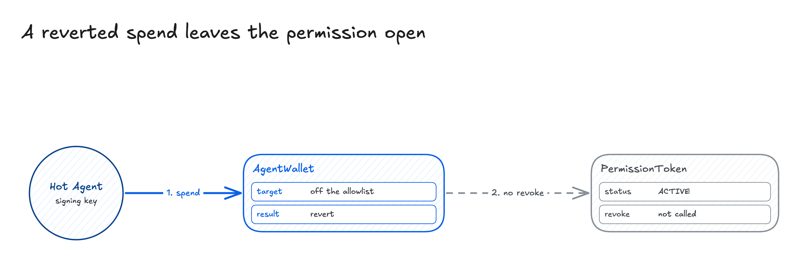
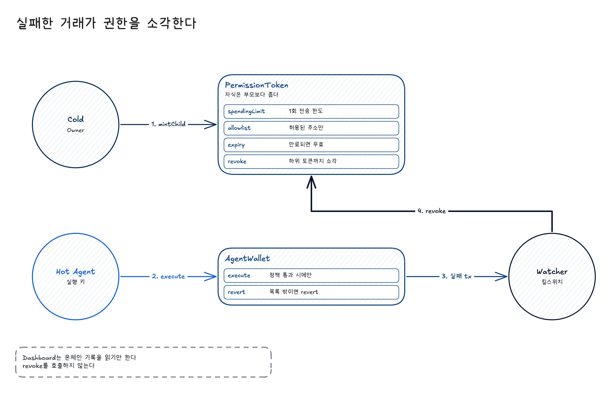
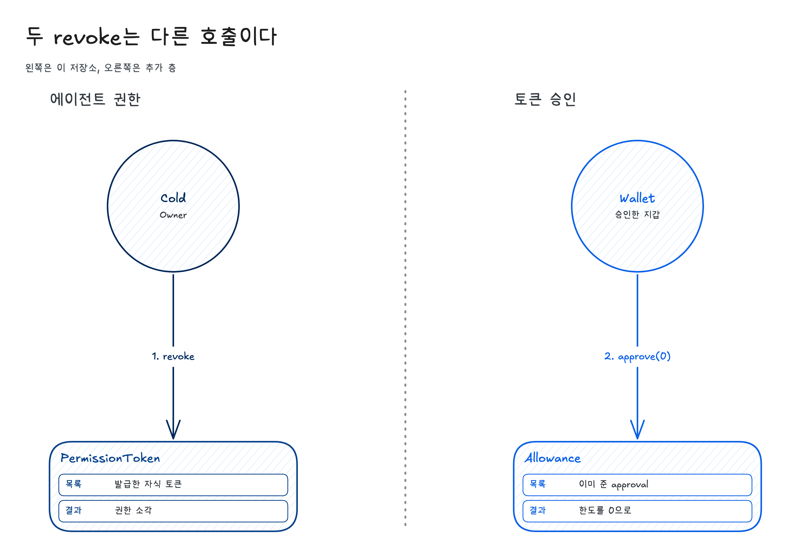
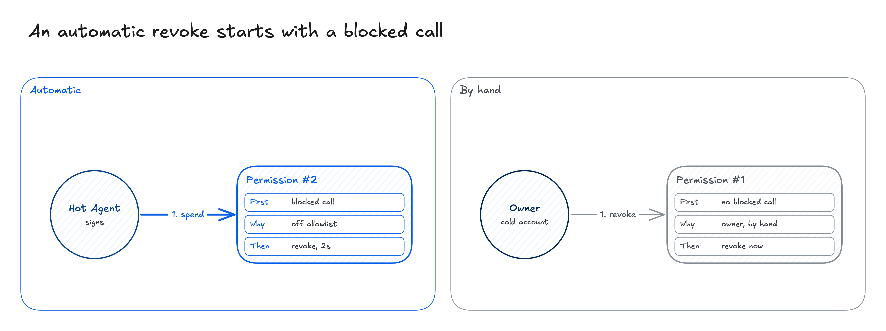

# Kill switch

Kill switch is a Sepolia page for the account that owns a permission root. That account is Cold. Cold mints the root, then hands a narrower child token to a second key, the Hot Agent. The Hot Agent spends by calling `execute` on AgentWallet. This page lists that tree and revokes what Cold is allowed to sign.

No key yet: [Run the mock](#run-the-mock). You already hold the Cold key: [Use a real account](#use-a-real-account).

Sepolia is Ethereum's public test network. The page at https://bay18th-killswitch.vercel.app only replays old transactions for the two contracts below. It sends nothing.

| Name | What it is |
| --- | --- |
| Cold | The owner account. It minted the root. Its key signs a revoke. |
| Hot Agent | The other key. It holds the child token and calls `execute`. |
| Root | The first PermissionToken. `parentId` is 0. Cold holds it. |
| Child | A PermissionToken minted under the root. Its spending limit is no higher, its expiry is no later, and its allowlist is a subset of the parent's. |
| Allowlist | The addresses that token is allowed to call. Any other target reverts. |
| Watcher | The process `npm run watch` in [`agent-scripts/`](agent-scripts). It is not this web page. |

Contracts: [PermissionToken](https://sepolia.etherscan.io/address/0xA09511600787d4BF40A49CE3501af2C23d737584) `0xA095…7584`, a soulbound ERC-721, and [AgentWallet](https://sepolia.etherscan.io/address/0x0B26b3d6500E8Cf03189042b3341d5be7774d29F) `0x0B26…d29F`, which holds the ETH. `execute` runs only when the caller owns the token and `checkPolicy` accepts the target and the value. The target tree is written out in [`docs/architecture.md`](docs/architecture.md).

## The problem

The Hot Agent calls `execute` with a target that is not on the allowlist. `checkPolicy` reverts. The ETH does not move. The child token stays `ACTIVE`. An ERC-20 allowance, an NFT operator approval, or a Permit2 approval the agent already submitted stays open. Permit2 is Uniswap's contract for a standing token allowance. The owner is looking at a failed transaction. The delegation is still live.

A reverted spend leaves the permission open.



## The kill switch

The kill switch is this page plus the watcher. The watcher holds the Cold key, polls new blocks, and on a failed `execute` calls `PermissionToken.revoke` on that child. The burn takes every token under it. The page draws the tree and writes the reason on the row. The page does not poll, and it does not revoke by itself.

`freeze` is reversible. Validity checks it up the ancestor chain, so a frozen parent makes the child invalid too. Only the parent owner can freeze or revoke. The Hot Agent cannot revoke its own token. If the watcher process is stopped, a bad `execute` still reverts, and the child stays valid.

A failed transaction burns the permission.



## Two features

1. Click revoke. You press a button in the page. The connected wallet signs. `Revoke` is the call Cold can sign for that row. `Revoke agent` is the button when the agent key would have to sign. The row stays, and the button burns the child's permission instead of clearing that approval.
2. Automatic revoke. The watcher burns the permission after a blocked call, with no click. The row says the call was outside the allowlist and that the revoke landed two seconds later. A revoke Cold signs by hand is marked as by hand, and that row has no blocked call in front of it.

Both appear on the same page. Click uses the wallet you connected. Automatic runs only while `npm run watch` is running.

## How click revoke works

The account card is the block for the connected account. It shows the root permission and, when that account's own code is an EIP-7702 delegation, the delegation. EIP-7702 lets an account run another contract's code. Token approvals Cold granted on its own stay off that card.

Under the Hot Agent, the page lists the public records that agent submitted:

- an ERC-20 allowance (`approve`)
- an NFT operator (`setApprovalForAll`)
- a Permit2 allowance
- an ENSv2 role, read from `EACRolesChanged` on the Sepolia ETHRegistry [`0xD4eBcbBdF463C9c45784603Db0dDD499BC44A8B4`](https://sepolia.etherscan.io/address/0xD4eBcbBdF463C9c45784603Db0dDD499BC44A8B4). A registry deployed separately for one ENS name is not listed.
- an EIP-7702 delegation on the agent account

`Revoke` sends the call Cold can sign. A permission token uses `PermissionToken.revoke`. An allowance Cold owns uses `approve(spender, 0)`. An NFT operator uses `setApprovalForAll(operator, false)`. Permit2 uses its own `approve` to zero. Cold's own 7702 delegation is cleared. Burning the token does not set an allowance to zero. Those are different calls.



`Revoke agent` is the other button. The row keeps two lines: "This approval stays until the agent key signs." and "Revoking the agent does not clear this approval." On a child token the button calls `revoke` on that child. On an ENSv2 role, if Cold is the admin, it calls `revokeRoles`. The allowance the agent already opened is still there after either call.

## How automatic revoke works

The watcher does not wait for a click. A failed `execute` whose target is outside the allowlist is a blocked call. Two seconds later the watcher revokes that permission. The row carries both sentences: the Hot Agent tried to spend at an address outside the allowlist, and the watcher revoked the permission two seconds later. A by-hand revoke says the owner did it, and no blocked call came first.

An automatic revoke starts with a blocked call.



On the AgentWallet deployed at `0x0B26…d29F`, that automatic revoke only burns the permission token. It does not set an allowance to zero.

## Run the mock

This path needs no key. You are checking the page, not sending a Sepolia transaction. A Revoke click is printed in the terminal of `npm run scene`. It is not broadcast.

You need Node. The app reads `app/.env`. Copy it from the example. The log scan starts at block `11805675`, the block where PermissionToken was deployed.

Terminal 1, the page:

```bash
cd app
cp .env.example .env
npm install
npm run dev
```

Terminal 2, the mock wallet. `npm run scene` serves a new Cold and a new Hot Agent that exist only in this process:

```bash
cd agent-scripts
npm install
npm run scene
```

Open http://127.0.0.1:5173/?mock=1 and press Connect. Connect tells the page to use the mock account. Leave that tab open. Terminal 3, from `agent-scripts`:

```bash
npm run scenario
```

The mock's root is permission #4: limit 0.003 ETH, allowlist Uniswap, expiry 2030-01-01. The Hot Agent holds children #1, #2, and #3, each at 0.001 ETH. On the agent the mock also grants a WETH allowance of 1 to Uniswap, Seaport as operator of the Uniswap v3 position NFT, a Permit2 allowance of 0.25 WETH, ENS resource 11, and an EIP-7702 delegation to MetaMask's delegator contract. Token names are still read from Sepolia, so the rows show those names.

`npm run scenario` plays four beats on the open page. When it finishes, the page should show:

1. After 1.6s, #2 tries to spend 0.0001 ETH at `0x0000…00b1`, which is outside the allowlist. The call is blocked. #2 is still active.
2. After 2s, the watcher revokes #2.
3. After 1.6s, Cold revokes #1 by hand. No blocked call precedes it.
4. #3 stays active, so `Revoke agent` is still on the agent rows.

Refreshing during the play shows whatever beat the mock has already reached. Run `npm run scenario` again to play from the start.

These are different scripts, not this path. `npm run mock` loads an older Cold account whose permissions are already on Sepolia. The first Connect can take about a minute. `npm run qa` adds one allowance, one operator, one Permit2 approval, one role, and one frozen permission to that account, in memory only. `npm run mock -- --once` prints the tree and exits. `npm run llm` calls a model and broadcasts. Do not use it for the scene above.

## Use a real account

Cold's key has to be in a browser wallet you already control. This repository does not create that key. Use a testnet key.

```bash
cd app
cp .env.example .env
npm install
npm test
npm run dev
```

Open the URL the dev server prints. Connect the Cold wallet. Leave the network on Sepolia. The page reads from block `11805675` and sends the revokes that wallet can sign.

To mint a new root and child on chain, and to run the watcher against them, use the same Cold key. Copy [`.env.example`](.env.example) to `.env` at the repo root and fill `COLD_PRIVATE_KEY` and `HOT_AGENT_ADDRESS`. The scripts read the environment. They do not open that file themselves, so load it in the shell first. `npm run setup` writes `state.json` in [`agent-scripts/`](agent-scripts). The other scripts read it, so run them from that folder.

```bash
cd agent-scripts
npm install
set -a
source ../.env
set +a
npm run setup       # Cold mints a root, then a child for the Hot Agent
npm run watch       # polls new blocks and revokes on a failed execute
```

Leave `npm run watch` running. In another terminal, load the same `.env`, then from `agent-scripts`:

```bash
set -a
source ../.env
set +a
npm run normal      # a transfer checkPolicy accepts
npm run malicious   # a transfer outside the allowlist; the watcher revokes
node demoExtra.js   # a too-wide child is rejected, then freeze, unfreeze, and a cascading revoke
```

If `npm run watch` is not running, `npm run malicious` still reverts, and the child stays valid. The `normal` and `malicious` scripts are fixed transactions, not a live model.

From a clean checkout, the contracts build with Foundry:

```bash
cd contracts
forge install foundry-rs/forge-std OpenZeppelin/openzeppelin-contracts
forge build
forge test
# optional deploy: PRIVATE_KEY and RPC_URL
forge script script/Deploy.s.sol --rpc-url $RPC_URL --broadcast
```

`contracts/lib` is not in the repository. `npm run build` in `app` writes `app/dist`. Do not commit that folder.

| Path | Role |
| --- | --- |
| [`app/`](app) | The page. |
| [`contracts/`](contracts) | `PermissionToken.sol`, `AgentWallet.sol`, tests, `deployments.json`. |
| [`agent-scripts/`](agent-scripts) | Setup, the watcher, the mock wallet, the scenario. |
| [`dashboard/`](dashboard) | The replay at the Vercel URL. Open `index.html`, or deploy with `cd dashboard && npx vercel --prod`. |
| [`docs/architecture.md`](docs/architecture.md) | The target tree and each record type the page reads. |

`.env`, private keys, and `state.json` are gitignored. The repository contains no key. Keep a key out of chat, issues, and documents.
