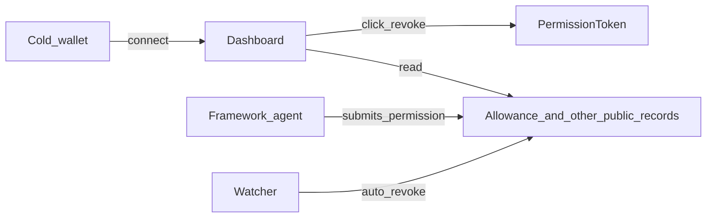

# Architecture

This document records the target product. The Sepolia screen is the Vite app in [`app/`](../app). [`dashboard/index.html`](../dashboard/index.html) stays a read-only replay of the two prototype contracts.

## Purpose

One connected account. The page is one tree for every public agent record tied to that account.

The tree has three levels:

- Wallet A, the connected account.
- Each agent delegation under A. The public formats in this tree are `PermissionToken`, Permit2, EIP-7702, and ENSv2 roles. A private list inside another app is not a row.
- Under each agent, the approvals that agent has submitted, such as a token allowance to a bridge.

Both revoke sizes are always in the product:

- Revoke one approval, when wallet A is the account that must sign that call.
- Revoke the whole agent, when wallet A is the admin of that delegation.

An agent created in this framework can also be revoked by the watcher, without a click. That path does not replace the tree.

MetaMask revokes MetaMask execution permissions inside MetaMask. This page does not operate that private list.

## What the prototype does today

The prototype is four pieces.

| Piece | Role |
|---|---|
| [`PermissionToken.sol`](../contracts/src/PermissionToken.sol) | Soulbound ERC-721. Each token is one permission: a per-call spending limit, an allowlist, and an expiry. Tokens form a parent-child tree. A child cannot be wider than its parent. |
| [`AgentWallet.sol`](../contracts/src/AgentWallet.sol) | Holds the ETH. `execute` runs only when the caller owns the token and `checkPolicy` accepts the target and the value. |
| [`watcher.js`](../agent-scripts/watcher.js) | Off-chain. Polls new blocks with the Cold key. If the Hot Agent sends a transaction to `AgentWallet` and that transaction fails, the watcher calls `PermissionToken.revoke` on the child token. |
| [`dashboard/index.html`](../dashboard/index.html) | Read-only. Replays transactions to two fixed Sepolia contracts and draws the tree, status, and log. It sends no transaction. |

On-chain rules the prototype already enforces:

- `freeze` pauses a token and every descendant. The issuer can unfreeze it.
- `revoke` burns the token and every descendant. The burn is permanent.
- Only the owner of the parent token can freeze or revoke a child. The Hot Agent cannot revoke its own token.
- The watcher revokes only while that process is running. A failed `execute` still reverts if the watcher is stopped, and the child token stays valid.

## Two paths on one screen

The target screen has two paths. The click path uses the wallet the user connected. The automatic path uses the watcher, and only for an agent this framework deployed.

**Click.** Wallet A connects. The page reads the public formats listed above, for A and for each agent the index has linked to A. A click sends only a call A is allowed to sign. See "Revoke sizes".

**Auto.** An agent created here is an account whose code this framework deployed. The watcher knows that storage layout and can execute as that account. If the agent submits an allowance or a session action outside scope, the watcher sends that account's revoke. The same screen shows the row. The dashed read on the diagram is the index. It does not by itself send a transaction.

An agent that is a separate key can appear in the tree, with the approvals that key has submitted. Wallet A cannot sign that key's `approve(spender, 0)`. The watcher cannot either.

## Permission families the index must know

"Agent permission" is not one object. The index reads each family from the place that family stores the record, and the click builds that family's revoke call.

### ERC-20 and ERC-721 allowance

The record is an `Approval` log on the token contract. The remaining amount is `allowance(owner, spender)`, or `isApprovedForAll` for an NFT operator.

Revoke is `approve(spender, 0)` or `setApprovalForAll(operator, false)`. The token owner signs it. If the agent address is the token owner, the agent's key must sign, unless this framework can execute from that account.

### Permit2 standing allowance

[Permit2](https://developers.uniswap.org/docs/protocols/permit2/overview) stores a time-bounded allowance after an EIP-712 `permit` is submitted to `AllowanceTransfer`. Until that submission, the signature is not on-chain.

The index reads the Permit2 allowance: token, spender, amount, expiration. The owner invalidates that spender. A Permit2 `SignatureTransfer` is one transaction. It leaves no standing allowance to list.

### EIP-7702 authorization

[EIP-7702](https://eips.ethereum.org/EIPS/eip-7702) is a transaction type. The EOA signs an authorization tuple `(chain_id, address, nonce)`. After inclusion, the account code is the delegation designator `0xef0100 || implementation`.

That signature installs wallet code. It does not itself store the spend limit. The limit is a session key inside the implementation.

The index reads the account code of wallet A and of each known agent. Clearing the delegation is a new authorization to `address(0)`, signed by that same EOA. Wallet A cannot clear a different EOA's delegation.

### Session key

The smart account stores each key with its own fields: target contracts, function selectors, a spend cap, an expiry, and sometimes a call quota. Layouts differ by vendor. Examples include ERC-4337 and ERC-6900 accounts, and session-key modules behind a 7702 delegation.

The index can list a session key only when it knows that module's storage or events. Revoke is that module's revoke function, signed by the account owner.

### ERC-7710 delegation through ERC-7715

[ERC-7715](https://eips.ethereum.org/EIPS/eip-7715) is how a dapp asks a wallet for a scoped execution permission. The wallet returns a permission context. [ERC-7710](https://eips.ethereum.org/EIPS/eip-7710) is how a session account redeems that delegation through a `DelegationManager`. Caveat enforcers reject a call outside the scope. Revoking the root delegation disables child delegations.

MetaMask keeps the grant list in the wallet. A dapp that requested the permission can call `wallet_getGrantedExecutionPermissions` and `wallet_revokeExecutionPermission`. This dashboard does not receive that list. Those revokes stay inside MetaMask.

### ENSv2 role

[ENSv2 Enhanced Access Control](https://docs.ens.domains/ensv2/enhanced-access-control/) stores roles on a name. The admin of those roles calls `revokeRoles(uint256 resource, uint256 roleBitmap, address account)` on the registry. That call removes the agent's role on the name. It does not set the agent's token allowances to zero.

The pinned registry is the Sepolia ETHRegistry in [`docs/decisions/ens-v2.md`](decisions/ens-v2.md): `0xD4eBcbBdF463C9c45784603Db0dDD499BC44A8B4`. The assignee log is `EACRolesChanged(uint256 indexed resource, address indexed account, uint256 oldRoleBitmap, uint256 newRoleBitmap)`. The app scans that registry only. A per-name UserRegistry is a different contract and is not part of this index. Resource 0 uses `revokeRootRoles` because `revokeRoles` reverts on `ROOT_RESOURCE`.

### PermissionToken

This protocol's record is already on-chain. [`PermissionToken`](../contracts/src/PermissionToken.sol) is the soulbound token described above. Cold, the owner of the parent token, signs `revoke`. The click path can send that call as soon as the dashboard has a wallet connection. The current page does not.

## Revoke sizes

The check is the signer of the call, not the label on the button.

Wallet A can revoke one approval when A is the owner of that approval. The calls are `approve(spender, 0)`, `setApprovalForAll(operator, false)`, and Permit2 `approve(token, spender, 0, 0)`. A can also clear an ERC-20 allowance owned by `AgentWallet` after K0 selects `permission-token`, through `AgentWallet.clearErc20Allowance`. The agent delegation stays.

Wallet A cannot revoke one approval that a different account already signed. An ERC-20 `approve` is authorized by the token owner. If the owner is agent B, the token contract accepts B's signature and does not accept A's. The same rule applies to a Permit2 allowance owned by B, and to an EIP-7702 authorization on B: only B can replace B's code.

When that small call is impossible, the row stays on the screen with two lines: `This approval stays until the agent key signs.` and `Revoking the agent does not clear this approval.` If A can revoke the delegation that contains the row, the row also offers `Revoke agent`. For a `PermissionToken` child, that button calls `revoke` on the child token. For an ENSv2 role, that button calls `revokeRoles` once the registry address is pinned. Burning the token, or revoking the ENS role, stops later use of that delegation. It does not set B's existing bridge allowance to zero. The bridge can still pull tokens that sit in B.

## What the index cannot show

- An EIP-712 permit, or an ERC-7710 delegation, that was signed and never submitted. Nothing on-chain exists to read. A later nonce bump can invalidate it only when this wallet is the signer and the verifier stores that nonce.
- Another app's private role list. MetaMask's granted execution permissions are the example. Each app revokes the roles it issued.
- The standing allowance of agent B is shown. The one-approval revoke still needs B's signature. The whole-agent revoke is a separate call and does not clear that allowance.

## Framework account

The automatic path needs one account implementation. The watcher then has one revoke function and one storage layout.

This document does not pick the implementation. The two candidates are:

- Keep [`PermissionToken`](../contracts/src/PermissionToken.sol) and [`AgentWallet`](../contracts/src/AgentWallet.sol). The watcher already calls `revoke` after a failed `execute`. Extending it means the same Cold key also clears allowances the framework account itself granted.
- Use an EIP-7702 smart account whose session-key module the watcher can call. The 7702 authorization points the agent EOA at that module. The watcher revokes the session key, or sends `approve(spender, 0)` through the account, when the agent acts outside the key's scope.

The choice is recorded in [`docs/decisions/framework-account.md`](decisions/framework-account.md). `Choice` is `permission-token`. The watcher keeps burning a `PermissionToken` after a failed `execute`, and it also calls `AgentWallet.clearErc20Allowance` when that function is on the deployed wallet. The wallet at `0x0B26b3d6500E8Cf03189042b3341d5be7774d29F` was deployed before that function existed, so auto-clear waits for a new AgentWallet deployment. The click path does not.

## Tasks

The work is cut into one Spec and one Plan per task, in [docs/tasks/README.md](tasks/README.md). Before a task, the agent reads the lane pages in [docs/lane](lane/working-rules.md). Those pages pin versions, types, screen strings, errors, the QC gate, and the definition of done. A disagreement between pages is a stop, not a choice.

The screen lists every public format above at the same time. K0 records the watcher account in [`docs/decisions/framework-account.md`](decisions/framework-account.md). That choice is `permission-token`, so K12 adds `AgentWallet.clearErc20Allowance` and no other contract function. K17 scans the registry and event in [`docs/decisions/ens-v2.md`](decisions/ens-v2.md). K1 through K17 do not change `dashboard/index.html`.

## Non-goals

- This dashboard does not revoke MetaMask execution permissions, or any other app's private role list.
- One click does not clear every signature family. It clears the public records the connected wallet is allowed to sign.
- Unsubmitted permits and unsubmitted delegations are out of the index.
- This document does not change the Sepolia contracts, the watcher, or the static dashboard.
